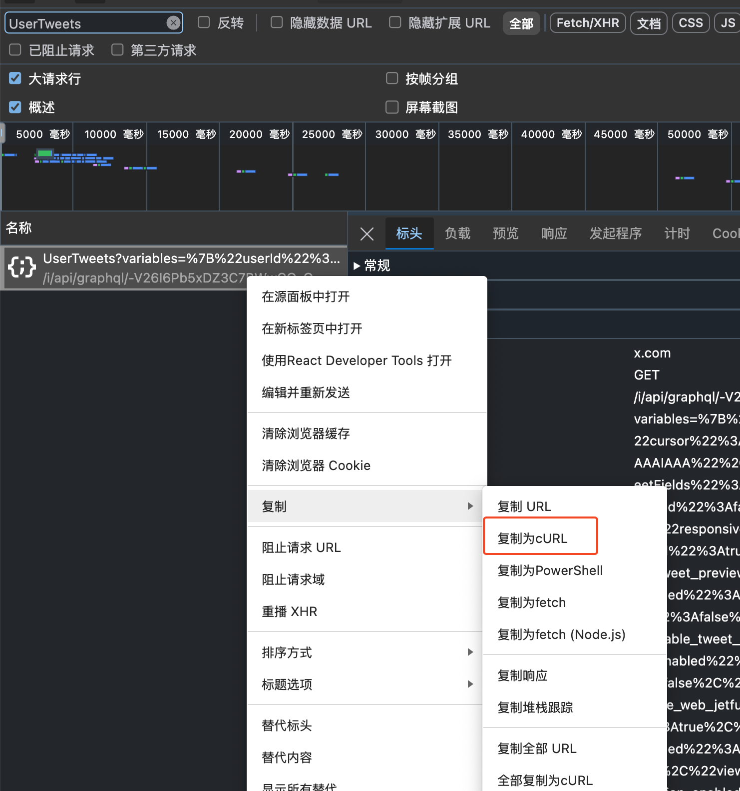

# X Archiver

一个用于归档和浏览 Twitter/X 推文的工具。通过爬虫脚本获取推文数据，并使用现代化的 Web 界面进行浏览和查看。


> ⚠️ **重要提示**：该方法需要登录你的 X 账号(通常是账号已被冻结的)，且仅能获取个人账号的推文信息，无法获取他人账号的推文信息。

## **✨ 功能**

- 推文抓取与归档
- 界面浏览（无限滚动）
- 完整推文展示与 PNG 导出
- JSON 数据 + 配置化用户信息

## 🚀 快速开始

### 1. 安装依赖

```bash
pnpm install
```

### 2. 保存 cURL 到脚本目录

在浏览器中打开 X (Twitter)，按 F12 打开开发者工具，切换到 Network 标签页，然后访问你的个人主页。通过过滤字符串 “UserTweets” 找到 API 请求，右键选择 “Copy as cURL”，保存到 `script/curl.txt`。



### 3. 爬取和提取数据

#### 方式一：使用统一入口（推荐）

```bash
node script/index.js
```

这个命令会自动执行：
1. 爬取推文数据（保存到 `public/page_XXX.json`）
2. 提取推文条目（生成 `public/entries.json`）
3. 生成用户信息（生成 `public/profile.json`）

### 4. 启动前端应用

开发模式：

```bash
pnpm dev
```

构建生产版本：

```bash
pnpm build
```

预览构建结果：

```bash
pnpm preview
```

> ⚠️ **安全提示**：`script/curl.txt` 包含敏感信息，请勿提交到版本控制系统。

## ⚠️ 注意事项

1. **认证信息**：爬虫脚本需要有效的 Twitter/X 认证信息才能正常工作
2. **使用条款**：请遵守 Twitter/X 的使用条款和 API 限制
3. **数据安全**：认证信息包含敏感数据，请勿提交到版本控制系统
4. **使用目的**：项目仅用于个人学习和研究目的
5. **图片资源**：由于原推特存档机制限制，推文的图片资源可能无法找回

## 📄 许可证

[BSD 3-Clause License](./LICENSE)

## 🙏 致谢

- [react-tweet](https://github.com/vercel/react-tweet) - 推文展示组件
- [html-to-image](https://github.com/bubkoo/html-to-image) - 图片导出功能
