# 愧怍的职场故事

我的职场故事要从 5 月前入职的这家 AI 公司说起…

> 归档说明：文中推文的文字与图片来自本人 X 数据归档；未能留存的图片以缺页标记代替。

---

## 故事的开始

- 4 月底 AI Agent 部门成立

---

## 5 月

- 5.8 面试

> 投简历了，主动隐藏了网站的某些文章，怕被面试官看到🤡
> 主要还是今年就写了一篇文章，没把文章刷下去😔

> 又反转了，下午二面了，拿offer了，福州试用期8k，在考虑去不去🤤。

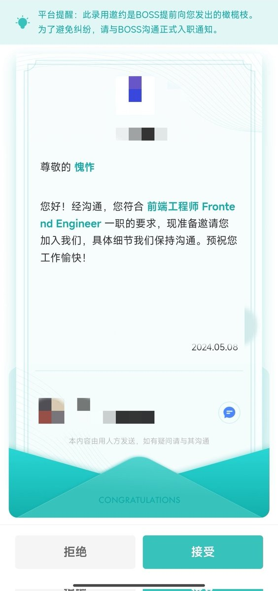

- 5.10 入职

> 今天成功入职了，第一天坐班结束，技术是 next.js 搞AI 全栈的。说实话能在福州这个地方找到这样投缘的公司真的很巧，最起码能让提起有点兴趣去研究。薪资在当地很可以，每日通勤不到40分钟。在当下就业环境，说真的可以知足了。
> 但不得不说，坐班是真的累，晚上吃完饭就只想着躺床上😀

- 5.15 公司来个阿里同事(前端)

> 今天公司来了个 React 前端，从阿里被裁员的，大专学历，有 10 年工作经历。 
> 人家听完我的背景和技术，说了句生不逢时，哪怕早几年毕业都能进大厂🥹。

- 5.17 部门第一次团建（之后三周的每周都团建一次），磨合期

> 在某AI公司上班一周目前得出以下结论
> 该部门成立不到 1 个月，现有员工10位，在我入职后陆续来了几位实习生，但写前端的就两个，其中一位是临近35岁的被阿里栽的老哥，还蛮聊得来。
> 我的 leader 是该公司的 CTO，有实力，值得学习。
> 部门还没什么实质项目产出，各个员工在不断学习AI领域相关的知识。

> 今晚公司新部门新员工团建，一个个履历的是真的丰富，有985的，有海外留学的，有在阿里，网易待过的，还有一个休学的我🤡。

- 5.21 部门提供 AI 相关的账户

> 这下真白嫖了🤤 https://x.com/kuizuo/status/1791346857433821421

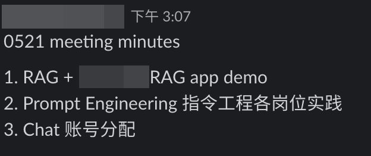

- 5.29 获得本月最佳员工奖🥳

> 公司给我颁发的本月最佳员工奖🥳

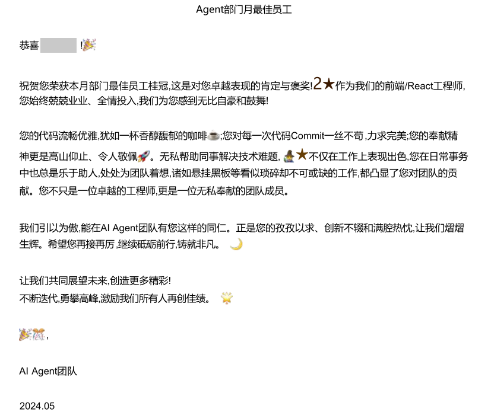

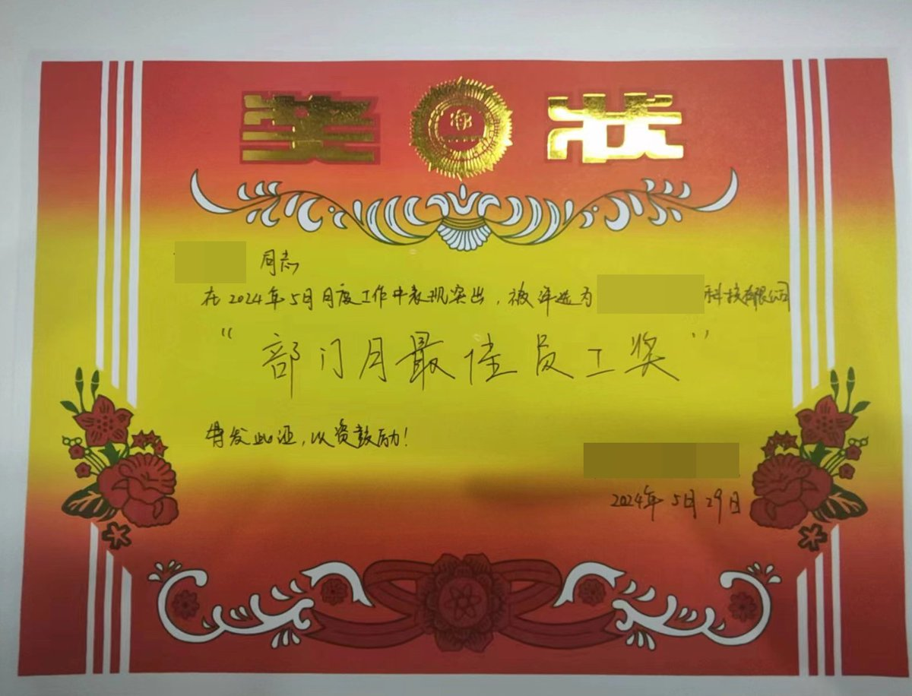

### 本月总结

这是我严格意义上的第一家公司，入职第一个月感觉部门氛围极佳，如同进入"神仙公司"⁠⁠，让我本就厌恶坐班的日子，似乎又有了盼头，这是我当时的感悟文。

> 记 · 在 AI 公司入职一个月的体验与感悟https://kuizuo.cn/blog/experience-of-an-ai-company

可之后的日子真如我幻想的一般吗？

---

## 6 月

- 6.6 部门内部举办黑客松 🏇

> leader 准备给部门举行个比赛，叫黑客松(hackathon)，也称编程马拉松比赛。分两组，选题有 打造某市地铁智能出行、给某商场的提供贴心的购物体验，都使用 AI chatbot 方式供用户使用，月底交付，奖金 3000/小组。第一次知道 hackathon 这个词，还挺有意思的别说🤠

- 6.11 入职一个月的感悟 💝

> 记 · 在 AI 公司入职一个月的体验与感悟https://kuizuo.cn/blog/experience-of-an-ai-company

- 6.12 前端同事离职🥲

> 今天下午在阿里写低代码的同事提离职了，虽然前几天就已经和我说了，但下午确认离职的还是有点不舍(因为部门只剩我一个人写前端了，这下是真给自己上强度了😭)。

小插曲：当时 LD 让人事让同事请假两天，周四周五连带周末共 4 天把同事的个人事情（私活）先处理完，然而在周日晚上的时候就被 LD 通知被裁了…

- 6.13 发工资💰

> 今天发薪资了，我一看工资单怎么缺勤扣了2000多😱。看了下员工手册，原来我5月10号入职的，6月发的是上个月整月的薪资，也就是5月10号到5月31号，少了5月前几个工作日的工资，而6月到现在的10多天还没结算。虚惊一场，还以为工资发错了😇

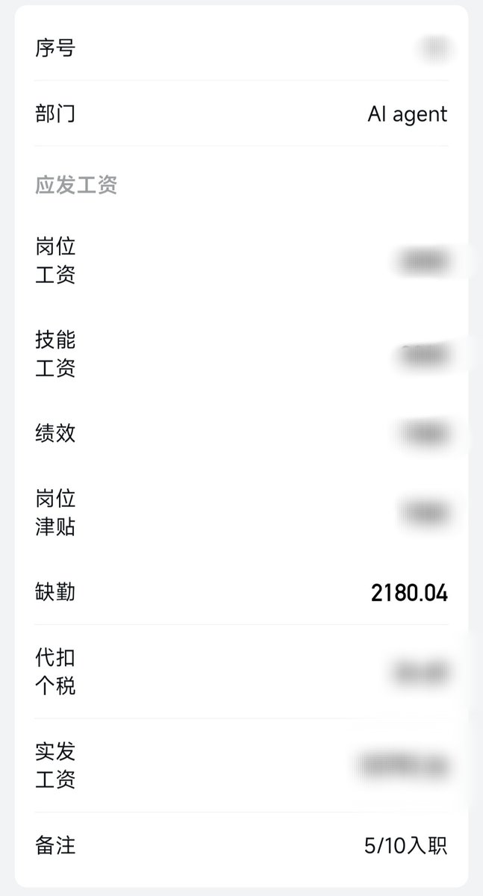

- 6.13 - 6.15 回校拍毕业照（早知道不去了，还请了两天假）😔

> 今天拍毕业照，让我开心的点就只是离毕业更近一步了。对母校没有任何留念之情，巴不得离开这个是非之地。不愿告知他人我读过的那所大学，对我来说如同耻辱柱一般。

> 离校了，过几天的毕业典礼也不打算不参加，上班期间实在不好请假，加上也不愿去，本身也确实没什么意思，到时候毕业证叫室友帮忙寄送一下便可。
> 我想大概率这辈子都不会再回学校了(我甚至都不愿说声母校)，如果要说大学给我带来了什么，可能也就 github 学生认证和各种学生优惠了。

- 6.21 早上 部门开会，整个部门被 LD 骂了一顿 🥹

> 我算是体会到职场 PUA 了🥲

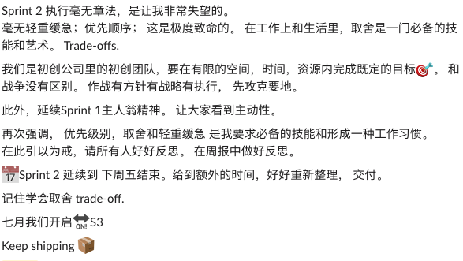

这是我 LD 的回复

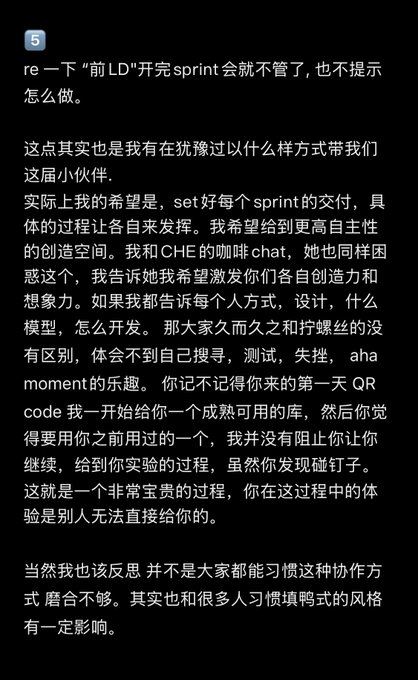

- 6.21 下午 LD 与 CEO 签署对赌协议（3个月绩效要求 30w）😯

> LD 和老板还吵了一架，还签了对赌协议，3个月看不出效果，部门立马解散。。。
> 不懂就问，这就是初创公司吗🥺

- 6.22 加上 CEO 的 wx 要找我了解部门项目情况，而不是 LD（不好的预感）😰

因为此时的 LD 甚至都不向公司汇报部门的进展情况，无奈 CEO 只能从员工下手。

> 卧槽，突然就加上老板微信了，本来说今天下午到公司找我谈话的，老板临时有事去参加活动，叫我明天到当地某个旅游景点找他。
> 我现在都有点懵了，昨天 LD 刚和老板吵了一架，下班后老板又突然找我，搞得我现在有点慌。。。🥺

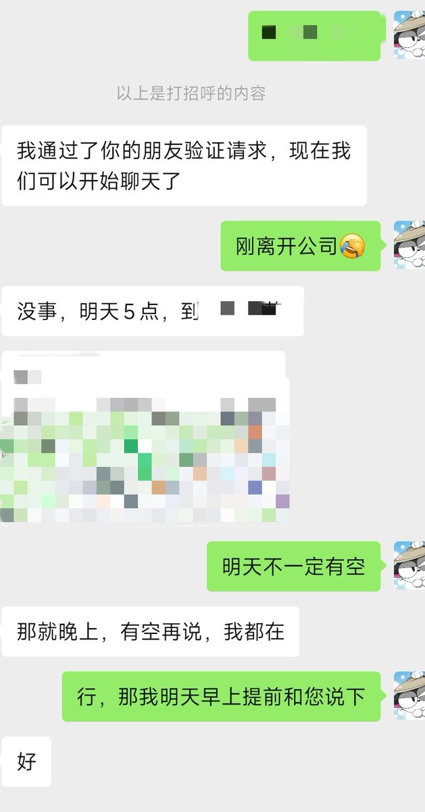

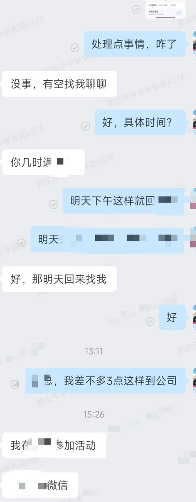

- 6.23 正式谈话，在场的有 CEO、技术总监、董事长(此时 LD 已有离职的意愿）💬

公司的关系网如下

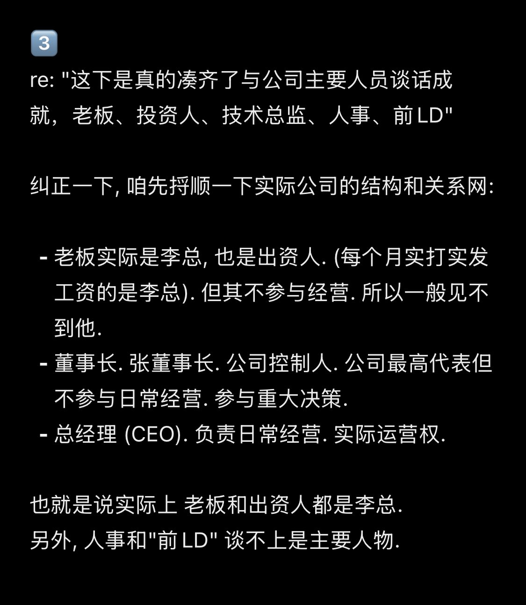

> 今天被做局了，我现在很生气🤬
> 
> 事情是这样的，今天下午是找老板谈话，其实在场的一共有 4 个人，分别是老板、技术总监(不是Leader)、一个我🤡，还有一个人(身份我后面揭晓）。 谈话的内容大致是这样的，老板说 LD 做的项目没有实质性收益，烧公司的钱，老板就要项目尽快落地变现，但 LD…

从对话中还得知了 LD 向公司申请插手市场相关，由他来招人，并管理市场运营。

- 6.24 LD 在投资人的劝阻下留下来了（其中我的猜测是错误的） ☕

> LD 在投资人的劝阻下，还是留下来了，但我反而不想待了😐
> 
> 今天开完周会大概率可以确定是由投资人促成了这个部门，从 LD 口中说到是那个投资人不让 LD 走，于是 LD 就继续做了。LD 和投资人的关系应该有些微妙，我猜测有可能是由父辈关系引荐的。
> 
> 对赌协议是由 LD 提的，要求 3 个月项目有 30…

- 6.28 黑客松项目成果验收，最后也是不了了之（因为对方那组少了个前端开发）💔

> 今天开完周会，也正好是月底那个黑客松比赛的项目成果验收。
> 但是另一组的前端程序员(阿里被裁的老哥)辞职了，我本以为这个比赛就暂时告一段落了，没想到早上突然说下午项目要验收。这下好了，我又是负责前端的，临时加急写了一下，现场展示的时候一堆问题， 我都尬死了🤣。
> 反倒另一组则是使用 python… https://x.com/kuizuo/status/1798612619647173013

### 本月总结

由于那位前端阿里同事的离职，导致黑客松进展不下去，部门内部的氛围在慢慢开始发生了一定的变化。

在 6 月中旬公司内部发生了一些冲突，CEO 认为部门成立近两个月，却没有实质的产品产出，故开始给 LD 施压，LD 转而给部门施压(PUA)，而我却被当做枪使一样，甚至被卷入到了职场内斗当中。但在董事长(投资人之一)劝导下，LD 暂且留了下来，但好景不长，LD 于 8 月 16 日再次离职，便一去不返。

---

## 7 月

- 7.6 去参加 VueConf ，请假半天坐车但不扣工资（相当于报销门票了）😇

> #Vueconf
> 听完今日的 Vue Conf 演讲，我又想写 Vue 代码了😭

- 7.10 距离本期的开发还有 9 天⏰

然而作为前端开发的我，直到本期结束，都没有任何可用后端服务，接口部分是由 LD 来完成的，然而他迟迟未给我，甚至我都再三催促了（我都开始催我 LD 了）

> 部门现在在做的AI应用偏客服向，完全可以基于 dify 社区版进行二开，但 LD 却要让我们从零开始搭建，可交付时间上根本不允许。叫我们做竞品分析，觉得某些竞品功能可以，就抄那个
> 距离这期结束还剩9天，到现在接口/数据库也没确定好，作为前端的我真不知道要做些什么。有时候真的是被迫处于摸鱼状态🫠

- 7.11 发工资💰

> 如期发工资了，但看了看这不到1w的薪资，辞职的念头瞬间涌上心头🥺

- 7.19 介绍了一下主要开发部门的成员情况🧑‍🤝‍🧑

> 一个 AI Agent 部门，就只有4个开发(3个py，1个前端全栈)，而且还都是应届生，汗流浃背了😅

- 7.23 由于 LD 迟迟未能提供接口，于是我想利用我自己的全栈开发能力，主动去接手了一些后端接口开发的活。

> 我丢，Vercel pro 计划原来这么扣，数据库的量就一点，已经开始收我💰了😅

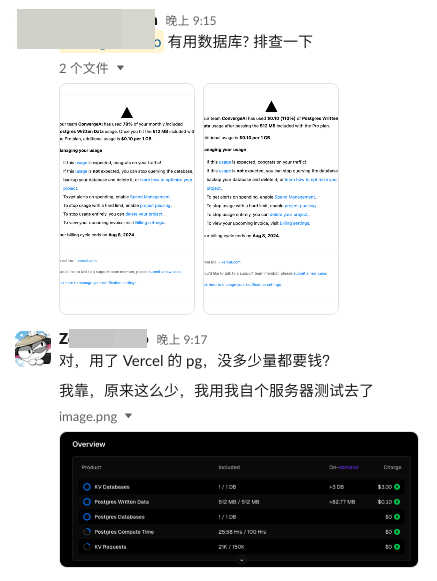

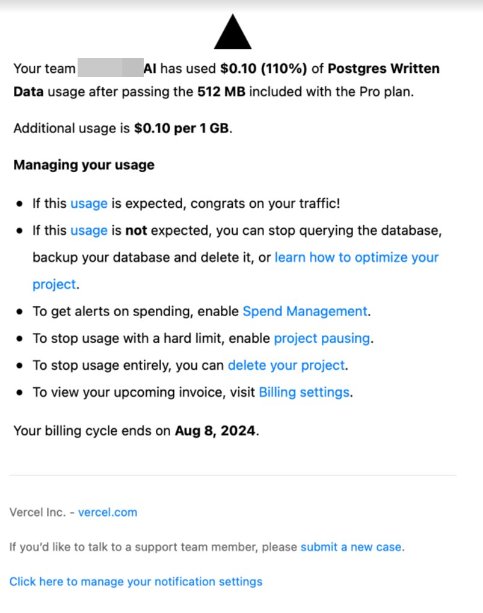

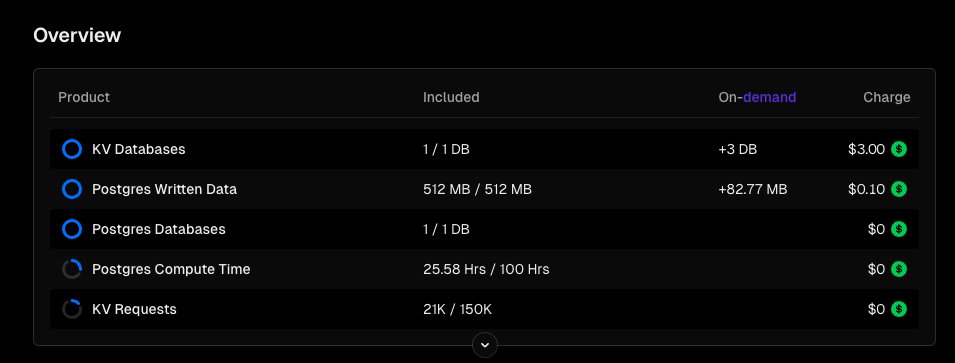

- 7.29 公司的导向将全面转向市场与媒体宣传，并大量新招市场人员。🏃

> 公司要开始疯狂搞推广，可问题是现在连个可用的产品都没有(还在持续开发中)，取巧选用国外同类竞品作为演示🤣。
> 
> 看到老板和LD开始转发公司公众号的文章，我在想我要不要朋友圈跟着转发一下，感觉发出去好丢脸🥺

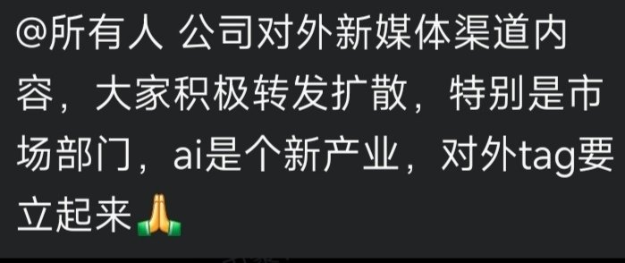

- 7.30 部门每月的生日午宴（团建）🎂

部门每个月的生日宴会，恰好我 7 月的生日。虽然嘴上说不过，其实内心还是很开心的，情绪价值拉满了🥰

> 还有生日蛋糕🍰！
> 只不过我已经不再过生日了😔 https://x.com/kuizuo/status/1818143536090669265

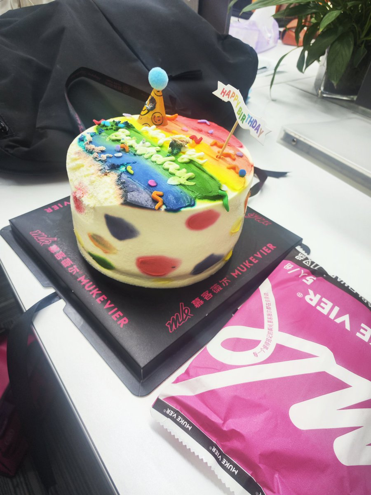

### 本月总结

从本月就能明显的感觉部门的开发已呈现的一团糟，本来这个项目的职责是这样的：

- 我负责前端（AI 对话，以及后台面板）
- LD 负责数据层以及接口服务（其实就是在 drupal 这个 CMS 系统上）
- py 开发的 3 位同事则分别负责 向量数据存储、爬虫、数据分析的微服务。

可是直到这个月结束，我 LD 所负责的活都还未完成，故导致项目其实一直处于卡壳状态，迟迟无法整合在一起。

这个月也是让我最为摆烂的一个月，需求不明确，协同也受阻。也开始对部门、对 LD 失去了原有的敬意。

---

## 8 月🌟

- 8.2 接手公司数字人项目+抄服务协议和隐私条款这些内容（ps. 这些活不是 LD 给的，而是技术总监，但这又是 CEO 的意思）😫

> 我是真服了，在初创公司上班，啥活都丢给我😅
> 真把我当牛马了😭，我干你🪵，下周提转正！

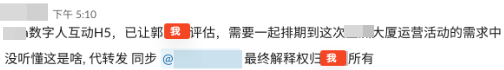

> 前同事(产品) 3 个月试用期到了，公司还卡转正，就硬拖，就在上周主动辞职了。唉，有点看清初创公司是什么模样了，也能感受到职场的残酷了。
> 老板似乎还有些看重我，但我怕我提的薪资(18k)难以接受，我看的出现在公司是真没什么钱，项目也没开始盈利，但以目前部门这状况，想盈利真的很难。

- 8.5 提交转正申请，此时的我在这样的工作强度下，已经不愿继续干下去了😩

> 也不知道写什么，转不转正都无所谓了，乏了，听天由命吧🫠。

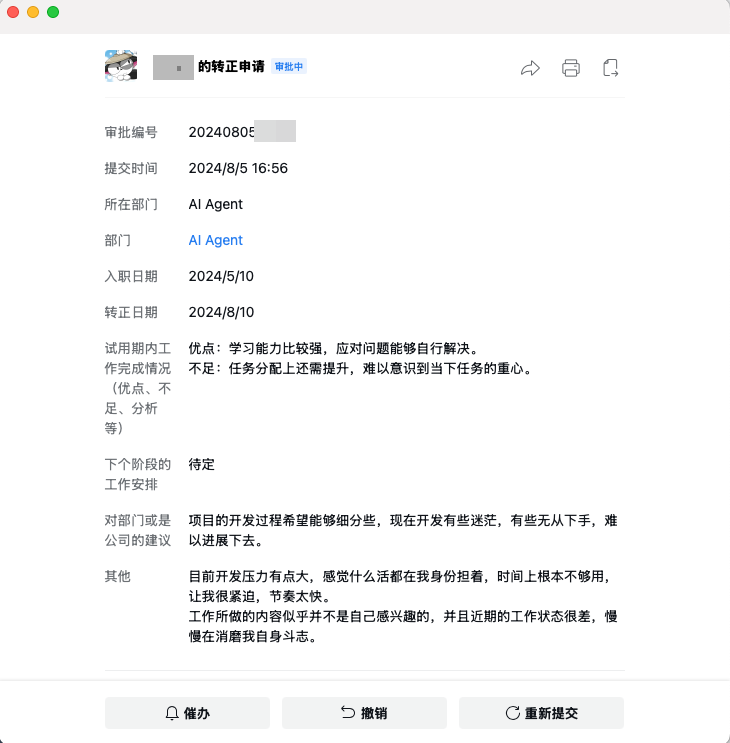

- 8.6 均未达到 LD 的转正标准，还抄送给老板和人事，10 x 的故事就是从这而来😡

> 先声明一下，这个其实是我LD发的，他抄送给HR和老板，但我真觉得我自己问薪无愧。公司所有的前端项目以及部分后端业务项目都是我来处理的，反倒是我LD饼画的有一手，都不催促项目，甚至到近期都不管部门项目，到老板来开始催我们员工了。
> 3个月前自认为部门有多好，现在我就有多失望和反感！

- 8.7  提交离职申请🤬

> 已提交离职对线申请书，求被单杀！

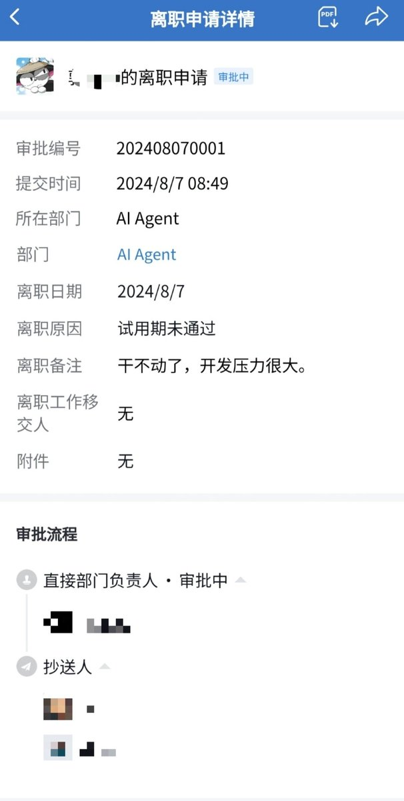

- 8.7 下午 与部门助理谈话，让我留下，实则缓兵之计🛬
- 8.8 和 CEO 、LD 谈完话 💬

> 已和老板、LD 对完线了，都是单独谈话。
> 
> 先是老板找我谈话，让我放平心，别想太多，有想留我的意思(毕竟再招一个我这样的牛马算是可遇不可求了)，薪资这些都能谈，有什么困难都可以说，总之一切以项目完成为主。
> 
> 随后就到 LD 了，LD 对我去留就很无所谓，还以为我有下家，有更好的平台。都不知道还有… https://x.com/kuizuo/status/1821146158951199162

- 8.8 公司试用期没交社保🙄

> 最让我不解的是，我今年5月入的职，我应该是签实习合同才对，但是我却签了劳动合同(我的应届同事签的就是实习合同)。
> 于是我去咨询了一下，劳动合同不交社保是违法的，巧的就是我这试用期 3 个月还真就没交社保🤡
> 
> 我不知道公司这波迷之操作目的是什么，还是单纯不懂法，有没有懂哥给我解释一下为什么

> **图片缺失**
> 原附图像未随数据归档留存

- 8.9 转正申请已通过🤡

> 转正申请已通过🤡 https://x.com/kuizuo/status/1820389600017457557

> **图片缺失**
> 原附图像未随数据归档留存

- 8.14 谈薪被拉扯🤮

> 感觉我被演了，最终薪资还在商讨中，大概率是给不了那么多。
> 
> 最让我不爽的是连谈薪都要踢皮球。我先找老板谈，老板说他不懂技术，叫我找 LD 评估技术薪资 --> LD 说他不管💰，要避嫌，招人是人事负责的 --> 于是找人事后又说决定权在老板那，找老板商讨一下再决定。。。…

- 8.15 LD 因财务纠纷，直接解散 Slack (办公应用)🫥

> 吓得我赶紧把 Notion 资料迁移到个人工作区，生怕下一秒也没了😨

- 8.16 中午 LD 抬走显示器，这次去意已决（原来自带显示器上班的不止我一个🤣）

> 今早 LD 把显示器搬走了，看样子是彻底不干了，部门该何去何从，我又该何去何从😔

- 8.16 下午 CEO 找我谈话，问我能否接手 LD 的烂摊子，我选择接下（事后回想，选择接手是我最后悔的决定😔）

> 前排提示，我晋升小LD了。
> 
> 我梳理一下事件流程，导火索是昨天下午公司财务找 LD 去核对一些服务的消费用途来源（比如说 Slack、Vercel、Github 等等海外服务），因为这些服务费用都是先刷 LD 的卡，然后向公司提了报销，但不知怎么就吵了一架，接着 LD 二话不说把 Slack 给解散了，提前下班。…

- 8.17 LD 的告别信🫡 ，实则他在这里埋了个伏笔，说对部门说是休假，却向公司提交离职书。（从这里开始，部门就已经不属于 LD 管了）

> 前 LD 的告别信🥹

> **图片缺失**
> 原附图像未随数据归档留存

部门报销单， LD 不愿将他自己的账户给公司（域名和一些服务），公司也不愿给 LD 报销这些费用

> 部门费用报销单来咯🤐

> **图片缺失**
> 原附图像未随数据归档留存

- 8.20 LD 与 DAN助理 + 董事长(投资人)一起吃饭，LD 本想叫我的， 但董事长觉得不合适，于是就算了。可惜不知对话细节😐。

这部分我没发推，这天的下午 LD 突然打视频电话给助理，让部门同事一个个接过手机说说最近的状况如何，其实就是 LD 想要了解部门的情况。至于饭局的细节，下图是 LD 的解释（此时他还未将我拉黑）

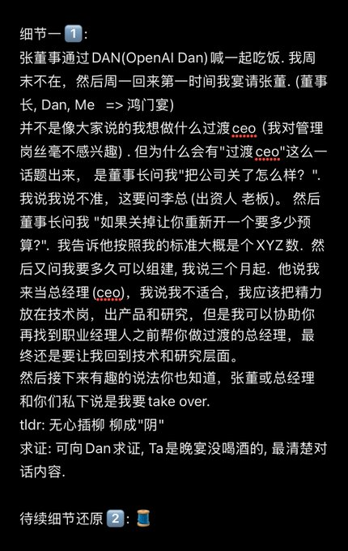

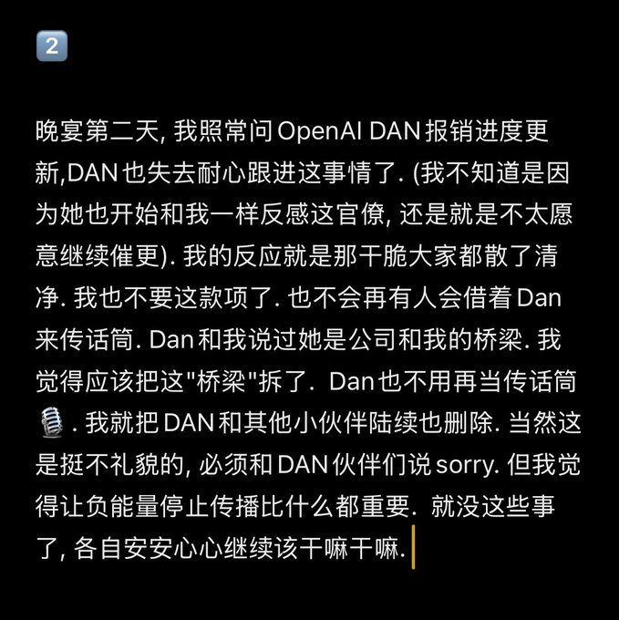

- 8.22 已离职的 LD 却来问我部门情况

> 今天 LD 突然发私信问我待遇谈的怎么样，我说薪资谈好了，只是合同还没签。
> 
> 反问了一句这薪资(15k)能接受？我直接说我内心也不是很想干，所做的杂事也偏离了我的技术栈，也偏离了我一开始进这个部门的初衷。…

- 8.24 通过我掌握的信息，我对 LD 分析是有两把刷子，但所表现的是个演子。**LD 似乎有报复公司的心理，并且并叫我离职不干🧑‍🎨**

> 前天投资人单独与我谈话 + 今天我与助理谈话，得知了非常多的信息，我来更新后续了，内容很多，还请耐心观看。
> 
> 首先 LD 不是投资人推荐的，而是老板招聘的，我之前一直误解 LD 和投资人是有一些关系，不然为何能那么任性，事实上 LD 也只是打工的。投资人一开始是看重 LD 的技术和想法，在第一次LD…

> **图片缺失**
> 原附图像未随数据归档留存

- 8.27 最后一次与 LD 谈话🌜

他找我要周报，我没给（因为我都没给技术总监写🤣），又看我还愿为公司办事，可能就因为这个把我拉黑了。

> 昨晚前LD一直从我这里打探部门消息，还找我要周报，甚至还问我部门最近谁生日，他还要来参加😅

> **图片缺失**
> 原附图像未随数据归档留存

> 处于好奇，我想看看我有没有被我前 LD 拉黑，于是向对方转账试了一下，果不其然我已经被拉黑了🤡
> 
> 我宣布第二季提前下架。

> **图片缺失**
> 原附图像未随数据归档留存

### 本月总结

我可以负责任地说公司有关前端开发的活都在我一个人身上，包括但不限于官网落地页 / AI 机器人对话 / 后台管理面板 / 数字人 H5，甚至有些后端的活还要我来做。（自那位前端阿里老哥离职后，最近入职的前端程序员还是在我离职前的一周才招的。。。）

然而此时的我薪资也就 8k（试用期 8 折，甚至试用期完完整整过了 3 个月），然而都这样了还要被 LD 卡转正，说不予通过。因此我当时十分生气😠，便提出离职，大不了不干了。

并且还让我甚至无心，无精力去搞我所想做的项目，不是我想要的工作强度与工作模式。只是我没想到的是，提完离职申请后，转正就顺利通过了🤡。更让我么没想到的是，随后的一周，LD 竟在我之前先行离去，留下了烂摊子给我。

我本不愿接手的，但或许是因为项目主要都是我在编写，并且 CEO 愿意涨薪留下，也不想那么快完结职场记录，于是我还是决定留下（此时很多推友都劝我赶紧走，说真的，我当时要是听你们的话，我 9 月也不会那么不开心了😭）

在 LD 离去后，还时不时从我这了解部门的情况（此时的他已将助理拉黑），这也是让我觉得抽象的点。最后一次聊天是他找我要周报我没给，可能就因此把我也拉黑了😢。

---

## 9 月

- 9.5 很平淡的一周 🎑

> 最近一周有人叫我催更职场记录，不是我不更，是这一周异常的平静，我前 LD 也有一周多都没再找我刷存在感，公司也没发生什么离谱事情。（除了活有点多之外🥲）
> 
> 同时我为了快点将项目交付完早点走了，最近心思一直在写代码上，因此推文发的也比较少。
> 
> 自我感觉这一周被驯化成一头纯牛马了🫠

- 9.14 吐槽薪资，只是为了引发讨论和争议，来提升话题的热度和传播度。💸

> 为什么我会问，是因为昨天我和技术总监谈过话(这下是真的凑齐了与公司主要人员谈话成就，老板、投资人、技术总监、人事、前LD😂)，然后技术总监和我提到了一下薪资的问题，大致意思就是觉得给我15k有点多(这是我当时和老板的口头答应)，说要按照合同上的转正薪资来给。… https://x.com/kuizuo/status/1834927847846429170

> 工资条来了，感觉我被演了😑 https://x.com/kuizuo/status/1834927847846429170

> **图片缺失**
> 原附图像未随数据归档留存

一些来自 LD 的细节

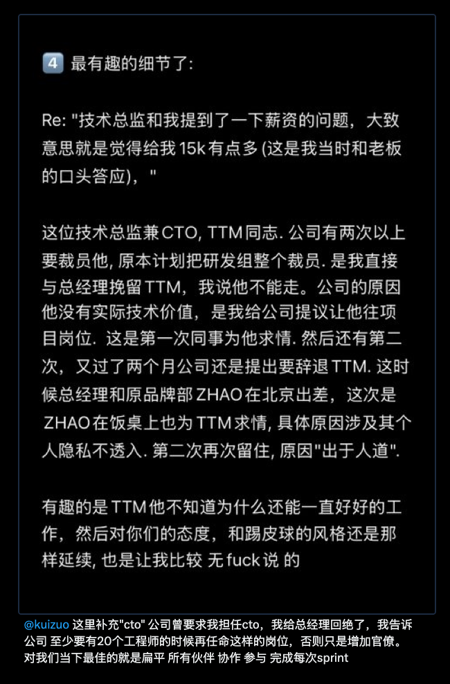

- 9.24 与同事吃饭聊到前 LD，说他新开了家公司，没想到还收到了他发起的沟通🐒

后来得知，这是 Boss 直聘的 牛人炸弹Pro 自动群发，之前有在平台上沟通过的应该都会收到

> 今天和同事吃饭的时候聊到前LD，说他新开了家公司，叫我去 Boss 直聘上看看。
> 
> 这不看还好，一看发现上周四他还在 Boss 上给我发私信，问我有没有考虑换工作🤣
> 
> 我不禁莞尔一笑，内心思索着是否延续 10x 神话

> **图片缺失**
> 原附图像未随数据归档留存

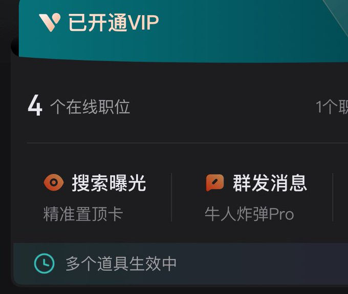

> 前几天不是说前 LD 新开了个公司，然后我刚刚和前同事(也就是那个阿里老哥）谈话的时候顺带提到了他。没想到也找了他，只不过是由另一人找的，是公司的市场部总监，难怪好几天没在公司见到他了，还以为是跑市场，原来和前 LD 合伙去了(猜测🫣)。…

- 9.27 第二次提交离职申请🏃‍➡️

在一周前其实就已经和 CEO 提过要离职了，只是当时似乎没人来接手我所写的项目。直到新来了一个前端同事后，到月底都处于项目交付期

> 这次是真的离职了🏃

> **图片缺失**
> 原附图像未随数据归档留存

- 9.30 正式得知被前 LD 拉黑，因为有近一个月没再联系我，我其实就猜测已经被拉黑了😈

> 处于好奇，我想看看我有没有被我前 LD 拉黑，于是向对方转账试了一下，果不其然我已经被拉黑了🤡
> 
> 我宣布第二季提前下架。

> **图片缺失**
> 原附图像未随数据归档留存

- 9.30 成功离职💨

> 成功离职了。
> 
> 但不知为何，此时的我却根本开心不起来🥹 https://x.com/kuizuo/status/1839515639922270473

> **图片缺失**
> 原附图像未随数据归档留存

> 走人😎

> **图片缺失**
> 原附图像未随数据归档留存

### 本月总结

在前 LD 的领导下，反而没什么实质的项目产出，饼倒是给公司画了不少。可以说，前三个月啥都没做出来。而这一个月才算是真正干活的一个月，产品是在这一个月内写出来的，甚至在这个月才真正卖出去了一份产品。

这个月我的心思都专注在开发上，我只想快点将这个项目交付完之后便走人。有关职场的推文较少发的就比较少，主要也没什么特别的事情可发。

说我 LD 才是真正的主角，而我扮演的是故事叙述者，很合理吧。

至此 ，我就真正与公司说拜拜了👋🏻，开始我的离职生活。

---

## 小插曲/花絮

- 被 LD 刷到推特

> 被前LD刷到我的推特是一种什么样的体验（真的）
> 
> 甚至还关注了我！😝

> **图片缺失**
> 原附图像未随数据归档留存

甚至还给我打赏

> 小愧的职场故事会的第一位打赏用户竟然还是我前 LD @gilzero
> 🤣🤣

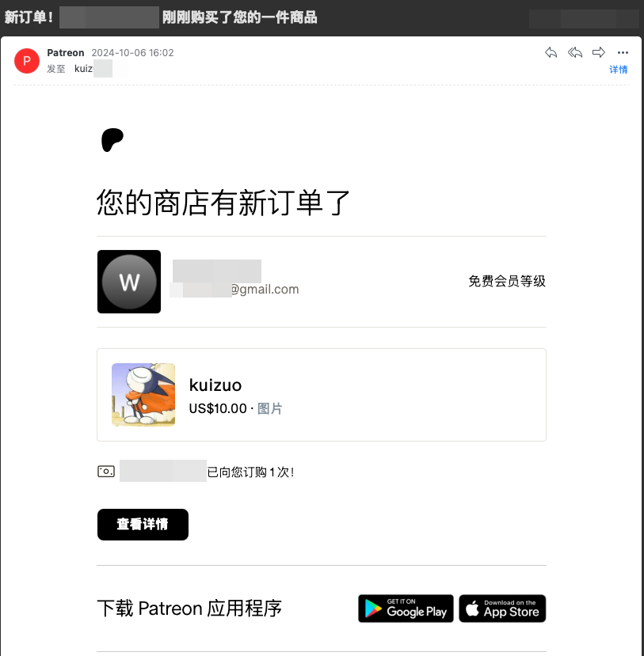

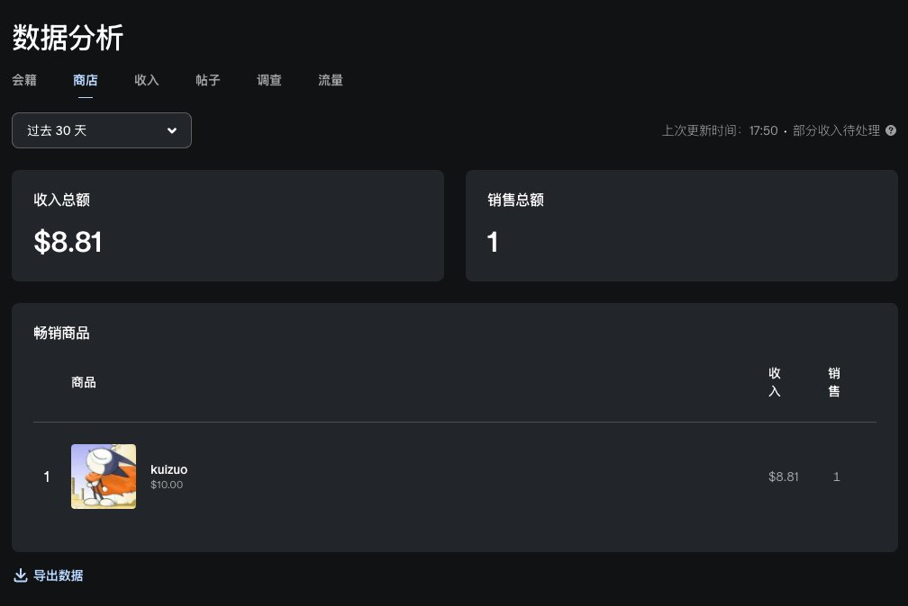

还有一部分我还不打算现阶段发布，例如我所负责的项目最终是怎么接手的，我为什么能知道一些细节（如费用账单)等等，不想造成给我一些不必要的麻烦，影响到我的同事（虽然我的同事也不刷 X）

---

## 离职的原因

我发现我在推上没有真正说明我离职的原因：

1. 从部门角度：LD 走了之后，其实部门就已经不存在了，此时便没有一个技术部门氛围，与我自己单打独斗没什么什么本质的区别。继续待下去，我学不到任何东西。
2. 从公司角度：公司目标很不明确，也一直处于探索的阶段，现在所做的东西还都是我 LD 当时所留下来的饼，甚至我离职之后还要走之前的老路（套壳 AI 客服），并且方向上也是市场优先，而非研发（就是看客户要什么，我们能写就写）。不想把在精力放在一个没有未来，如此混乱的项目上。
3. 从个人角度：我是一个容易焦虑，容易自我施压的心态。在这样一个不确定性很高的环境中，会极大的分散我的精力，会让我无心做自己想做的事情。还有我不是一个很听话的小孩，我会更愿意按照自己的想法去写代码。

当然离职的前提还是建立在我没有物质上的压力，手上也有一定的存款，倘若我现在有个房贷、车贷，我都不想象失业后的生活。

## 写后感

写完之后怎么感觉我成那种在网络上写长文曝光别人的人🤧，我只是喜欢记录与分享，写推文纯粹整活🤡，并非诋毁之意。

故事就当乐子，默默吃瓜🍉，如有困惑的地方，可留下你的评论。

职场记录完结后，我也要回归我的技术路线了。如果看的开心，也别忘了给我点点关注，我宣布第一季完结撒花🥳

最后我也要感谢公司，感谢 LD。没有他们提供这么多真实的职场素材，我也收获不了这么多粉丝，并且也给我的职场人生经历留下浓墨重彩的一笔🤣

**码字不易，感谢你耐心看完🙏**
